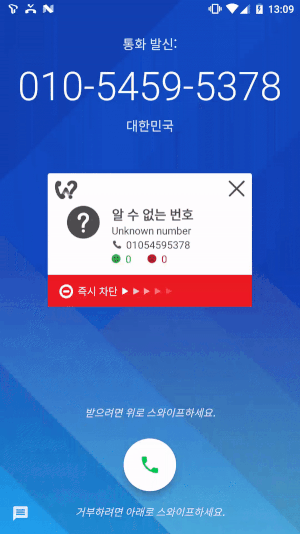

# WeezSwipeSwitch
Android Swipe Switch Widget

## Summary
간단한 스와이프 스위치 위젯입니다. 
스팸전화 차단 앱에서 많이 사용하고 있는 커스텀 위젯을 구현해 보았습니다.

## Demo


## Sample Code
```
WeezSwipeSwitch swipeSwitch = (WeezSwipeSwitch) findViewById(R.id.swipe_switch);
swipeSwitch.setSwipeOverlayColor(100, ContextCompat.getColor(this, R.color.colorAccent));
swipeSwitch.setBackgroundColor(ContextCompat.getColor(this, R.color.colorPrimary));
swipeSwitch.setOnSwipeSwitchListener(new WeezSwipeSwitch.OnSwipeSwitchListener() {
    @Override
    public void onSwitchOn() {
		Toast.makeText(getApplicationContext(), "Succeed", Toast.LENGTH_SHORT).show();
    }
});
```
  
## License
```
Copyright 2016 Oh, Su-cheol <ogoons@hanmail.net>

Licensed under the Apache License, Version 2.0 (the "License");
you may not use this file except in compliance with the License.
You may obtain a copy of the License at

    http://www.apache.org/licenses/LICENSE-2.0

Unless required by applicable law or agreed to in writing, software
distributed under the License is distributed on an "AS IS" BASIS,
WITHOUT WARRANTIES OR CONDITIONS OF ANY KIND, either express or implied.
See the License for the specific language governing permissions and
limitations under the License.
```
